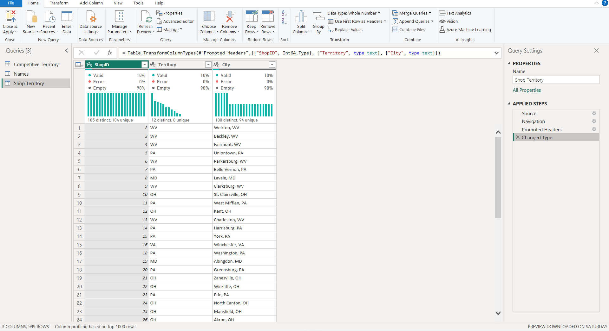
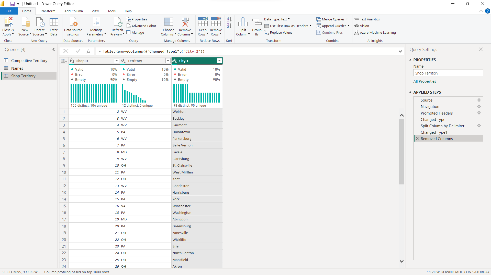
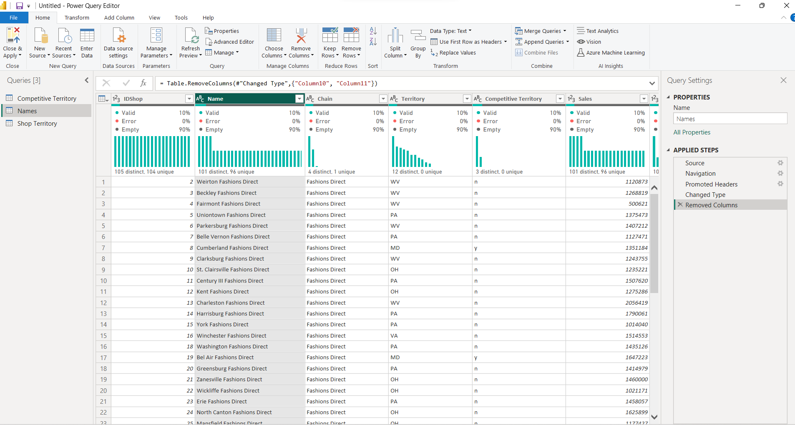
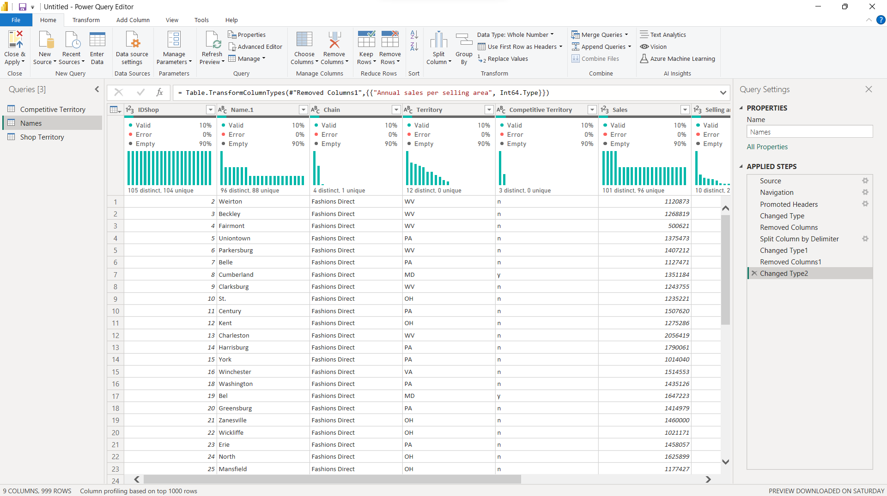
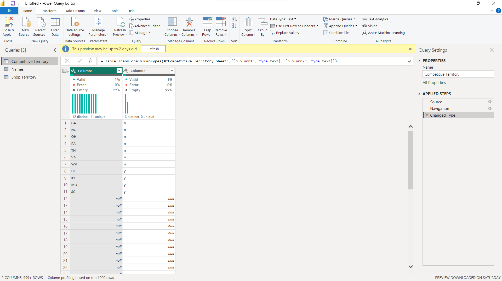
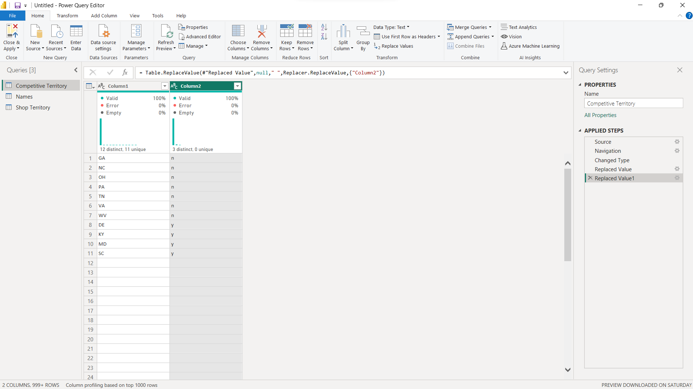
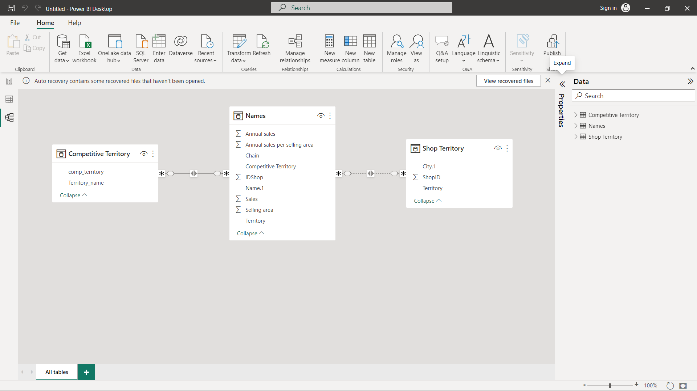

# BG-Fashion-Sales-Analysis

## Introduction
My current training at Utiva included a Capstone Project focused on BG Fashion Sales Analysis. This project allowed me to practice my data cleaning, analysis, and visualization skills using Excel. Additionally, I created a reporting dashboard to showcase my findings from the dataset. Overall, the project was an excellent opportunity to apply what I learned in training and gain hands-on experience with real-world data.

## Problem statement
- What are the top sales by City?
- What are the top 10 agents per sales value?
- Sales territory?
- Sales by validation?
- Sales chain category?
- Top 5 IDs per sale value?
Create a dashboard with the report and sliceable by:
- Territory
## Skills/Concepts Demonstrated
- Power Query
- Dashboard
- Data Modelling
## Data Preparation / Cleaning:
The dataset was shared with Utiva students, showing sales of BG Fashion Sales Analysis. It has 3 tables; Names (9 columns 105 rows) Shop Territory (3 columns 105 rows) Competitive Territory (2 columns and 11 rows)

## Data cleaning and transformation
##### For the shop territory,

- I had to split the city column

 

##### For the Name table

- I had to split the names column, set change the data type for sales, annual, sales, and Annual sales per selling area to whole number data type

 

##### The Competitive territory

I replaced the null with empty space for the two columns

## Data Modelling
I had to create relationships between the three tables

- For the Names table, columns IDshop many to many relationships with Shop Territory ShopID
- Competitive territory table, Comp_territory many to many relationships with the Names table competitive territory

## My Dashboard

To walk-through with my dashboard: https://app.powerbi.com/groups/me/reports/63f63c92-4ff5-4a96-8794-aa1e2b9766ae/ReportSection?experience=power-bi

## Recommendation and Conclusion
- Agents that generate the highest revenue should be rewarded, while agents that have the lowest revenue should be evaluated to identify areas for improvement.
- To maximize our reach, we should consider opening more stores in the top 5 cities with large sales.

